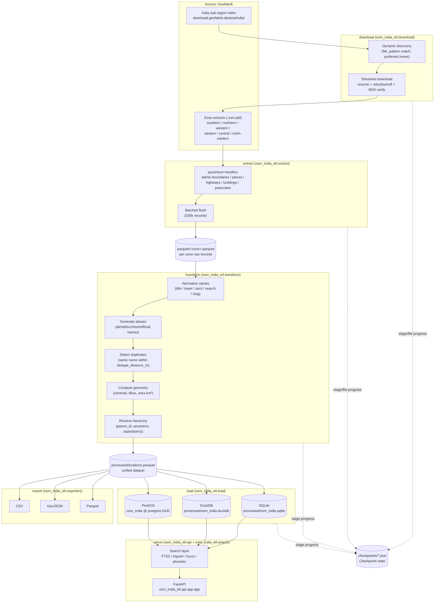
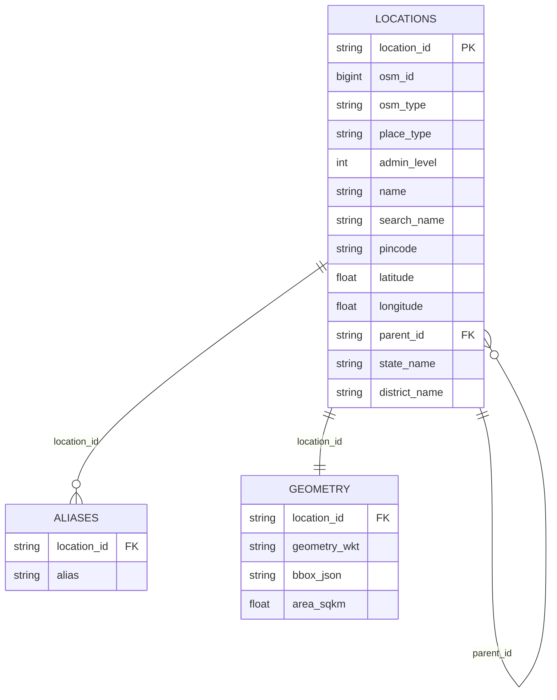
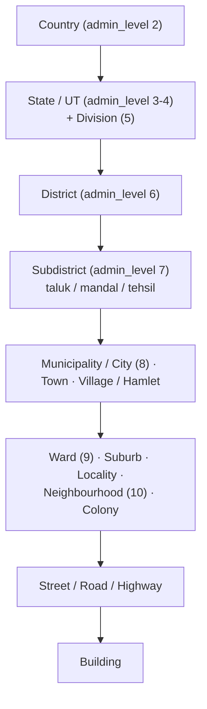

# Architecture

`osm-india-etl` is a staged, checkpointed pipeline. Every stage reads and writes well-defined artifacts on disk, so any stage can be re-run independently and the whole pipeline can resume after interruption.

## Pipeline flow

The `pipeline/` package orchestrates these stages for the `run` and `rebuild` CLI commands, consulting `checkpoints/` to skip completed work (`run`) or ignore it (`rebuild`).

## Component responsibilities

| Module (under `src/osm_india_etl/`) | Responsibility |
|---|---|
| `config.py` | Typed settings: loads `config/config.yaml` into Pydantic section models, applies `OSM_<SECTION>__<KEY>` env overrides with type coercion, resolves/creates data directories, exposes `get_settings()` singleton. |
| `constants.py` | Dependency-free OSM knowledge: `PlaceType`/`OSMType` enums, `admin_level` → tier map, `place=*` and `highway=*` classification, name/alias tag keys, the canonical `LOCATION_COLUMNS` output schema, entity/aux table registry, India bbox. |
| `models.py` | Data contracts: `LocationRecord` (in-memory record, `to_row`/`from_row` against `LOCATION_COLUMNS`), `DownloadItem` (a discovered extract), `Checkpoint` (recovery state). |
| `logging_setup.py` | Loguru configuration, log-file routing to `logs/`, rich progress integration. |
| `download.py` | Geofabrik index discovery, zone selection, streamed/resumable downloads with retry/backoff and MD5 + size verification. |
| `extract.py` | pyosmium streaming handlers over `.osm.pbf`; classifies nodes/ways/relations into `LocationRecord`s and flushes batches to per-zone Parquet. |
| `transform/` | Normalization (name forms, slug), alias generation, duplicate detection, geometry computation, hierarchy resolution; produces the unified dataset. |
| `load.py` | Materializes entity + aux tables into SQLite, DuckDB, and PostGIS (SQLAlchemy/GeoAlchemy2); builds search indexes (FTS5, `pg_trgm`). |
| `exporters/` | CSV, GeoJSON, and Parquet exporters over the unified dataset. |
| `api/` | FastAPI application (`api.app:app`): search/lookup/list endpoints, backend selection (sqlite \| duckdb \| postgis), CORS, health. |
| `search/` | Query engine shared by API and CLI: FTS5, trigram, rapidfuzz fuzzy/Levenshtein, jellyfish phonetic ranking. |
| `pipeline/` | Stage orchestration for `run`/`rebuild`, per-zone multiprocessing, checkpoint persistence and resume logic. |
| `utils/` | Shared helpers used across stages. |
| `cli.py` | Typer application (console script `osm-india-etl`; also invoked via `main.py`): `download`, `extract`, `transform`, `load`, `export`, `run`, `rebuild`, `validate`, `serve`, `search`. |

## Data model

### `LocationRecord`

The single record type flowing through extract → transform → load/export. It serializes 1:1 to the columnar schema `constants.LOCATION_COLUMNS`:

| Group | Fields |
|---|---|
| Identity | `location_id` (deterministic `{osm_type[0]}{osm_id}`, e.g. `n123`, `w456`, `r789`), `osm_id`, `osm_type` (node/way/relation), `place_type` (PlaceType), `admin_level` |
| Names | `name`, `name_en`, `name_native`, `name_title`, `name_lower`, `name_ascii`, `search_name`, `slug`, `names_json` (all `name:*` tags), `aliases_json` |
| Postal | `pincode` |
| Geometry | `latitude`, `longitude`, `geometry_wkt` (POINT/LINESTRING/POLYGON), `bbox_json` (`[minx, miny, maxx, maxy]`), `area_sqkm` |
| Hierarchy | `parent_id`, `parent_type`, `hierarchy_json` (ordered ancestor `location_id`s), `state_name`, `district_name` (denormalized for fast filtering) |
| Provenance | `tags_json` (raw OSM tags), `source_file` (originating `.osm.pbf`) |

`PlaceType` covers the full taxonomy: country, state, division, district, subdistrict, taluk, mandal, tehsil, municipality, city, town, village, hamlet, ward, suburb, locality, neighbourhood, colony, street, road, highway, building, postal_code (plus unknown). `TYPE_RANK` orders these for hierarchy building.

### Entity tables

The loader buckets records into per-tier tables (via `constants.TYPE_TO_TABLE`):

- **Entity tables** (same column schema, one per tier): `states`, `districts`, `subdistricts`, `mandals`, `taluks`, `villages`, `towns`, `cities`, `wards`, `localities`, `neighbourhoods`, `streets`, `roads`, `highways`, `buildings`, `postal_codes`.
  - Bucketing notes: `division` → `states`, `tehsil` → `subdistricts`, `municipality` → `cities`, `hamlet` → `villages`, `suburb` → `neighbourhoods`, `colony` → `localities`.
- **Aux tables**: `locations` (all records, unified), `geometry` (WKT/bbox/area per record), `aliases` (one row per alias for search).

## Hierarchy

Each record's `parent_id` points to its immediate ancestor; `hierarchy_json` stores the full ancestor chain. The tree (driven by `admin_level` 2–10, `place=*` tiers, and `TYPE_RANK`):

Postal codes sit outside the administrative tree (rank 99) and attach to records via `pincode`.

## Data flow & interchange

Parquet is the interchange format between stages:

1. **Extract** writes **per-zone Parquet** files under `parquet/` (one dataset per downloaded `.osm.pbf`, batched flushes of `extract.batch_size` records). Zones are processed independently, which is what makes per-zone multiprocessing and per-file resume possible.
2. **Transform** reads all per-zone Parquet, applies normalization/dedup/hierarchy **across zones** (boundary-spanning duplicates are resolved here), and writes the **unified** `processed/locations.parquet`.
3. **Load** and **export** both consume only the unified Parquet — SQLite/DuckDB/PostGIS tables and CSV/GeoJSON/Parquet deliverables are all deterministic projections of it. Rebuilding a database or export never requires re-parsing `.osm.pbf`.
4. **API/search** read from the loaded databases (backend selected by `api.backend`), never from Parquet directly.

Every column in every artifact follows `constants.LOCATION_COLUMNS`; `models.validate_schema()` guards against drift between `LocationRecord` and the schema.
